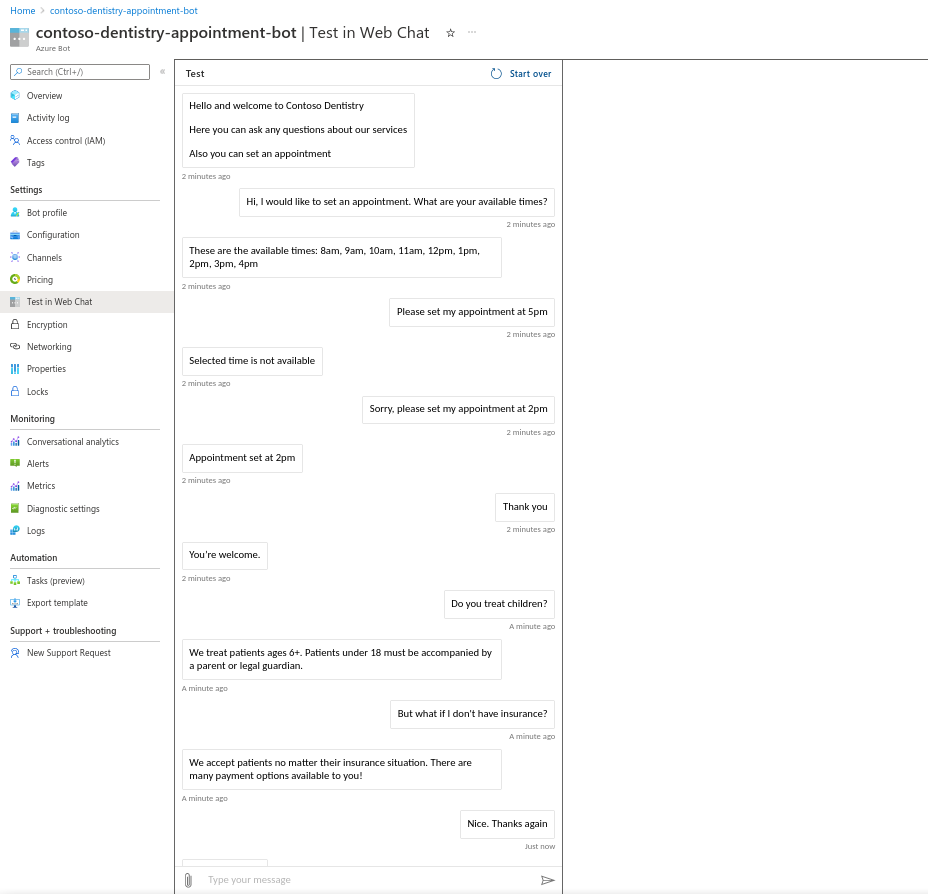
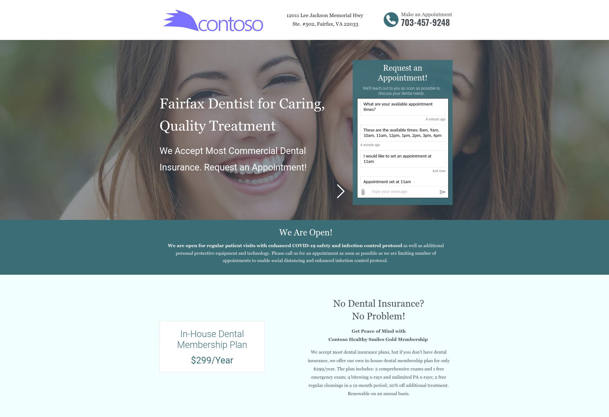

### Project: Dental Office Virtual Assistant

This is my submission for the Udacity's AI Engineer using Microsoft Azure Nanodegree Program second project, a customer support chatbot that lives on a dentist website. The bot will use Azure QnA Maker and LUIS to answer patient questions and help them schedule appointments. This bot is built using the Azure Bot Framework.

A diagram of the application architecture is below:

The repository for the scheduler API is located at https://github.com/unscatty/contoso-scheduler

#### Final results
The Contoso Dentistry website can be accessed at https://contosodentistrystatic.z21.web.core.windows.net/

Testing the bot in Azure Portal

Testing the bot in the dentistry website

